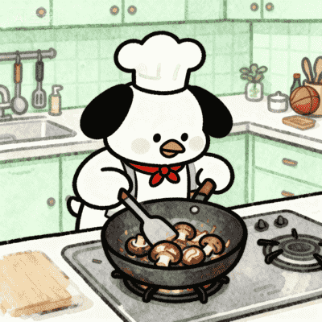
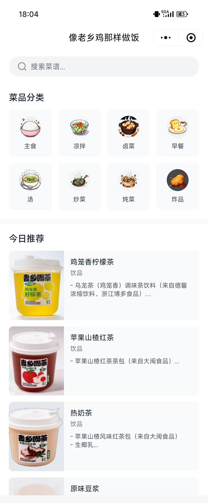
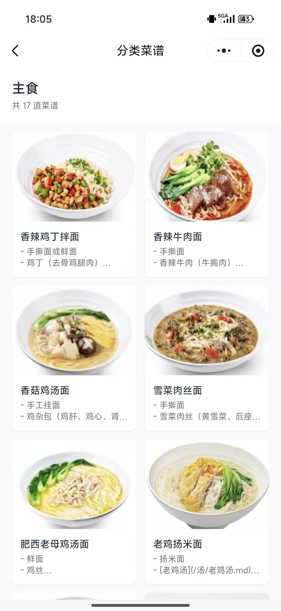
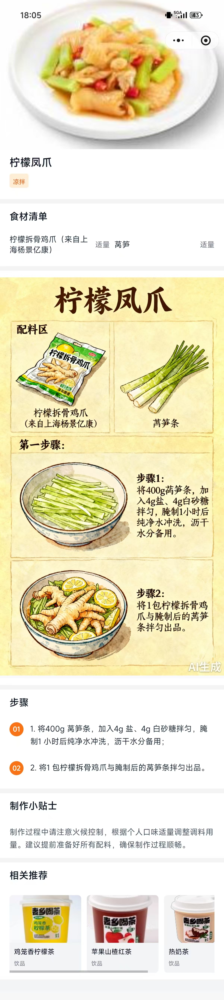

<p align="center">
    
</p>

<h2 align="center">MyCookLikeHOC · 像老乡鸡那样做饭小程序</h2>

> 受 CookLikeHOC 项目启发的数据与菜谱浏览应用，全流程 AI 开发小程序，支持一键初始化 Supabase 数据库与 Storage，开箱即用。

## 项目简介

- 基于 uni-app + Vue 3 + TypeScript 构建的跨平台应用，使用 [wot-starter](https://starter.wot-ui.cn/) 作为项目模板，UI 采用 wot-ui。
- 全流程由 TRAE SOLO 开发。
- 数据来源：[CookLikeHOC 像老乡鸡🐔那样做饭](https://github.com/Gar-b-age/CookLikeHOC)。
- 后端数据与文件存储由 Supabase 提供：数据库迁移、RPC、Storage 图标与流程图。
- 内置脚本可从 `cook-book/` 目录的 Markdown 解析菜谱，导入到数据库，并上传所需图片到 Storage。

## 小程序在线体验

<p align="center">
    
</p>

## 声明与致谢

- 本项目并非任何商家官方仓库，仅用于学习与技术交流。
- 感谢老乡鸡《老乡鸡菜品溯源报告》公布菜品，让我们能够像老乡鸡一样会做饭。
- 数据与灵感参考了社区项目 CookLikeHOC（感谢其整理与贡献）。如有问题或建议，欢迎反馈。

## 功能概览

- 菜谱浏览与分类筛选、关键词搜索。
- 分类 RPC（`get_unique_categories`）与 Supabase REST API 接入。
- 支持上传分类图标与菜谱手绘流程图到 Storage，并在前端展示。

<div style="display: flex; flex-direction: column; align-items: center;">
  
  
  
</div>


## 技术栈

- 前端：uni-app（Vue 3 + TS）、wot-ui、UnoCSS、Pinia、Alova。
- 构建：Vite。
- 后端：Supabase（Postgres、RLS、RPC、Storage）。

## 快速开始

1. 安装依赖

```bash
pnpm install
```

2. 配置环境变量（开发环境 `.env.development`）

```bash
# 前端（浏览器）使用
VITE_SUPABASE_URL=https://<your-project>.supabase.co
VITE_SUPABASE_ANON_KEY=<your-anon-key>

# 脚本（Node/TS）使用
SUPABASE_URL=https://<your-project>.supabase.co
SUPABASE_SERVICE_KEY=<your-service-role-key>
```

3. 一键初始化（迁移 + Storage + 数据导入 + 校验）

```bash
pnpm setup:all
```

或分步执行：

```bash
pnpm run setup:data       # 解析并导入菜谱数据
pnpm run setup:storage    # 上传分类图标与流程图到 Storage
pnpm run setup:verify     # 数据质量与样本校验
```

4. 本地开发

```bash
pnpm dev
```

## 数据库与存储

- 迁移文件位于 `supabase/migrations/`：
  - `001_create_recipes_table.sql`：`recipes` 表结构、索引与 RLS。
  - `002_get_unique_categories.sql`：分类 RPC（返回分类名称）。
- Storage 桶：
  - `category-icons`：分类图标（`cook-book/images/cook-category`）。
  - `process-images`：菜谱手绘流程图（`cook-book/images/cook-process`）。

## 脚本说明

- `scripts/upload-category-icons.ts`：上传分类图标到 `category-icons`（支持 `--recreate-bucket`、`--upsert`）。
- `scripts/upload-process-images.ts`：上传流程图到 `process-images` 并更新 `recipes.process_image_url`。
- `scripts/extract-recipes.ts`：解析 Markdown 导入菜谱（`--dry-run` 输出问题汇总）。
- `scripts/verify-data.ts`：总数、分类统计、空字段与样本校验（`--check-empty`、`--samples=N`）。
- `scripts/verify-process-images.ts`：流程图覆盖率与示例校验。

> 所有脚本从 `process.env` 读取环境变量，并自动加载 `.env(.development)`；不要在前端暴露 `service_role_key`。

## 许可

- 本项目基于 MIT 协议，请自由地享受和参与开源。
